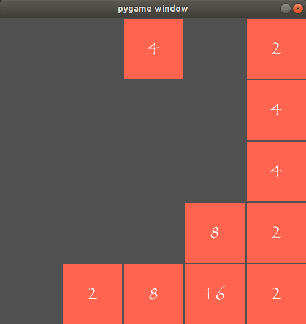

# 2048-pygame

2048 implemented with **pygame**.



To start the game, run:

```sh
$ python pg2048.py
```

Use **wasd** to control, **q** to quit!

Configure the parameter **sz** in *cmd2048.py* to modify the size of the board.